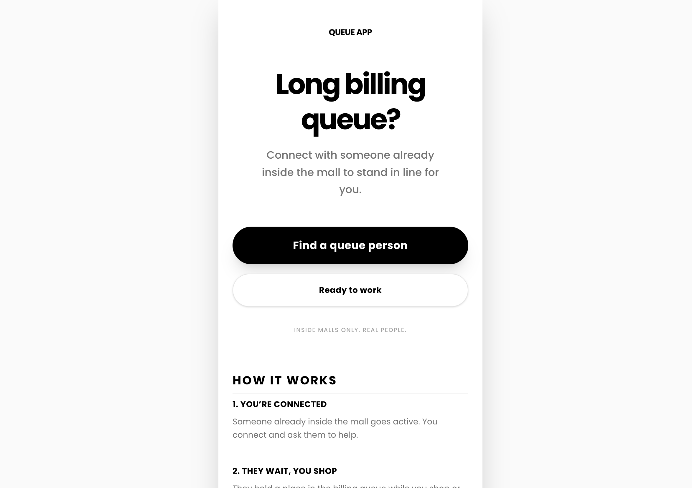
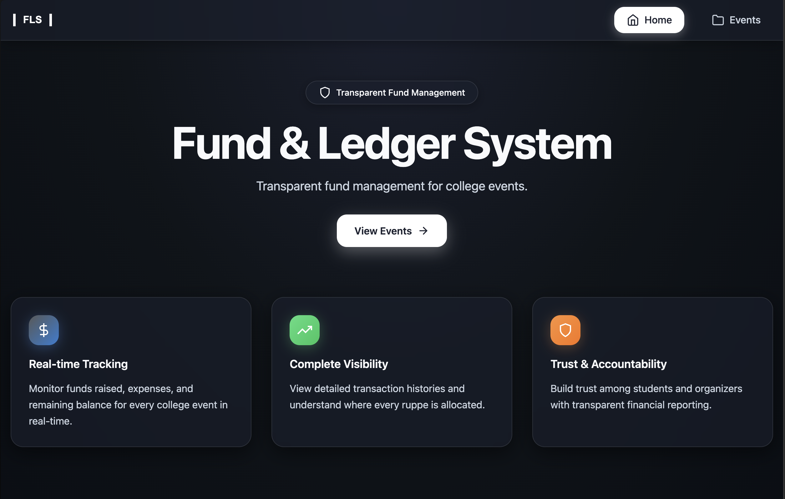
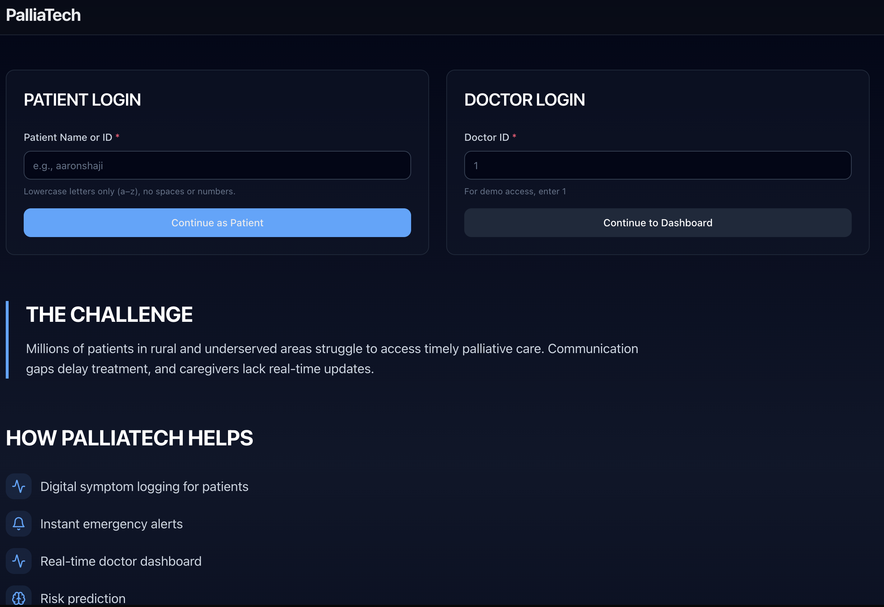
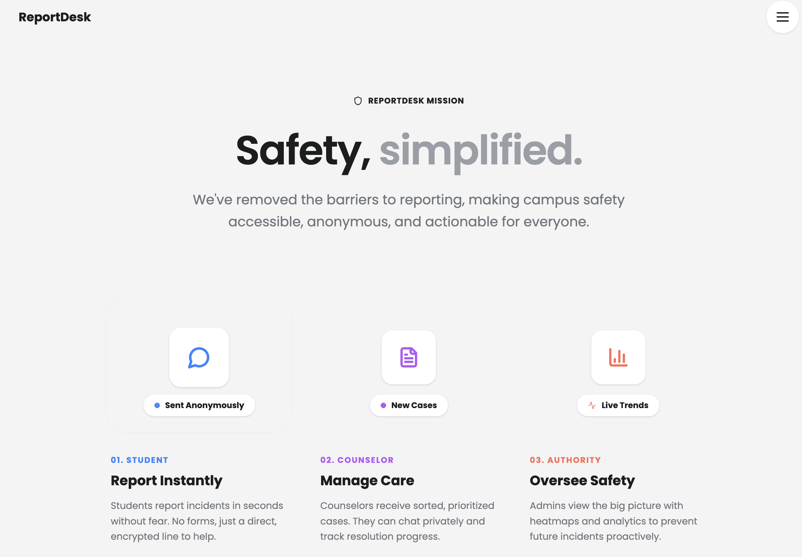

# Hackathon Builds

**Archive of hackathon projects.**

---
### QueueApp
A web app that lets you reserve a billing queue spot through someone already inside a mall, so you can shop or relax without waiting.

**Live** → https://queue-app-eta-red.vercel.app/  (best viewed on mobile)

---

### FLS — Fund & Ledger System
A transparent system for tracking college event funds: who collected money, who spent it, and where it went.

**Live** → https://fls-three.vercel.app/  

---

### PalliaTech
A healthcare platform concept supporting palliative care initiatives through digital tools and technology.

**Live** → https://palliatech.a6rron.in/  

---

### ReportDesk
An anonymous reporting platform that lets students report safety issues in seconds, while counselors and authorities track and prevent incidents using real-time insights.

**Live** → https://reportdesk.vercel.app/
